<div align="center">


# Gallileo-4D

### Frozen Backbone Ensemble for Dynamic 4D Reconstruction

**🥉 3rd of 27 teams — PhysAI Dynamic 4D Reconstruction Challenge (ECCV 2026)**

<br>

| Private (final, 75%) | Public (25%) | Rank | Training performed |
|:---:|:---:|:---:|:---:|
| **0.58356 APD** | **0.55513 APD** | **3 / 27** | **None — zero gradient updates** |

<br>

[](https://github.com/odaxai/Gallileo-4D)
[](LICENSE)
[](https://hub.docker.com/r/odaxai/gallileo-4d)
[](https://huggingface.co/OdaxAI/gallileo-4d-weights)
[](tests/)
[](VERIFICATION.md)

*OdaxAI Research — [odaxai.com](https://odaxai.com)*

</div>

---

## For Examiners — Verify in One Command

Every claim in this repository is cryptographically verifiable. Pick the level of scrutiny you want:

| | Check | Command | Needs | Time |
|---|-------|---------|-------|------|
| **A** | Full verification: hashes + bit-for-bit reproduction + test suite | `bash verify.sh` | Python 3 + numpy/pandas | ~2 min |
| **B** | Same, fully isolated environment | `docker run --rm odaxai/gallileo-4d:latest` | Docker only | ~2 min |
| **C** | GPU end-to-end: raw input videos → inference → CSV | `bash scripts/verify_gpu_inference.sh …` | GPU + challenge data | ~1 min |
| **D** | Regenerate everything from scratch | `bash scripts/node5_run_inference.sh` | GPU, ~168 GPU-h | days |

The submitted file `opt4_r728_116.csv` is shipped in this repository
(`reference/winning_submission.csv.gz`) and is reproduced **bit-for-bit**
(identical MD5 `24d729dedd16de4f65e2d67301455c48` and SHA256) by levels A and B on
any CPU architecture. Level C is verified **bit-identical** on the GPU used for
the winning run. Details in [Reproducing the Winning Submission](#reproducing-the-winning-submission)
and [VERIFICATION.md](VERIFICATION.md).

---

## Table of Contents

1. [Results](#results)
2. [Method](#method-inference-time-ensemble)
3. [Why We Do Not Train](#key-insight-why-fine-tuning-fails)
4. [Installation](#installation)
5. [Docker](#docker)
6. [Reproducing the Winning Submission](#reproducing-the-winning-submission)
7. [Testing](#testing)
8. [Software Architecture](#software-architecture)
9. [Training Experiments (Negative Results)](#training-experiments-negative-results)
10. [Qualitative Results](#qualitative-results)
11. [Repository Layout](#repository-layout)
12. [Computational Requirements](#computational-requirements)
13. [Citation](#citation)

---

## Results

Dynamic 4D reconstruction of two challenge test sequences. Each row shows the
reconstruction at the first queried timestamp t₀, an α-blend of first and last,
and the last timestamp t₁₉₁, with the recovered 3D trajectory of every tracked
point drawn over the full sequence and coloured by time.

<div align="center">

**Office** — *bright, cluttered interior with large lateral motion*

| t₀ | t₀ + t₁₉₁ | t₁₉₁ |
|:--:|:---------:|:----:|
| 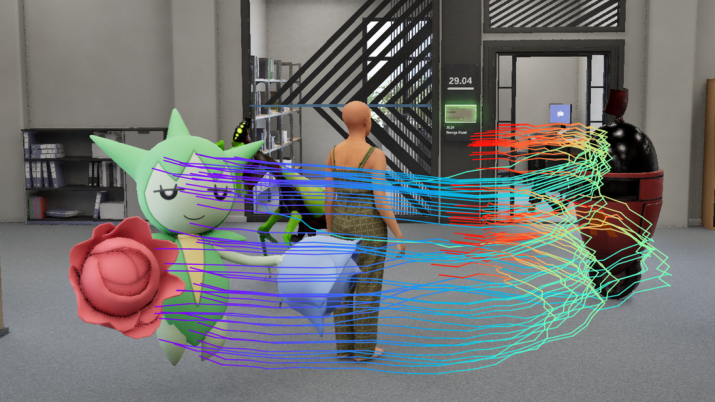 | 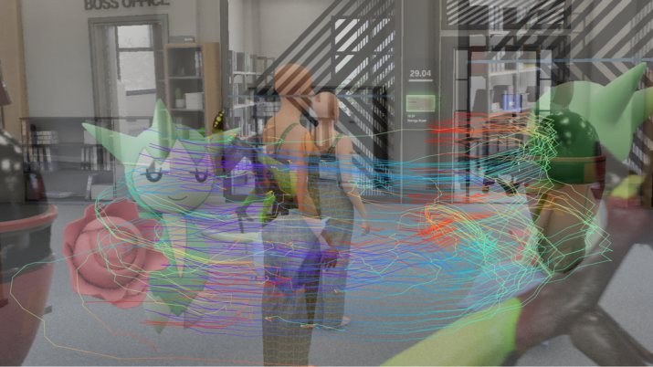 | 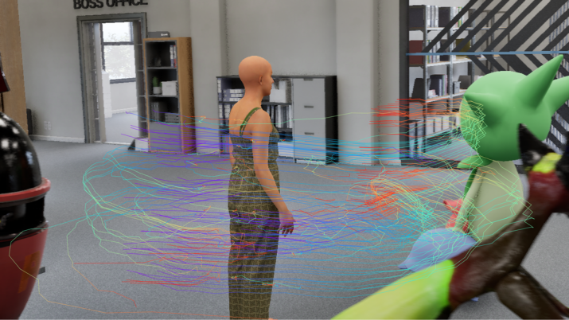 |

**Gothic** — *low light, self-occlusion, fast articulated motion*

| t₀ | t₀ + t₁₉₁ | t₁₉₁ |
|:--:|:---------:|:----:|
| 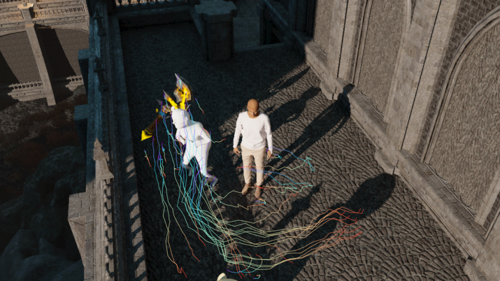 | 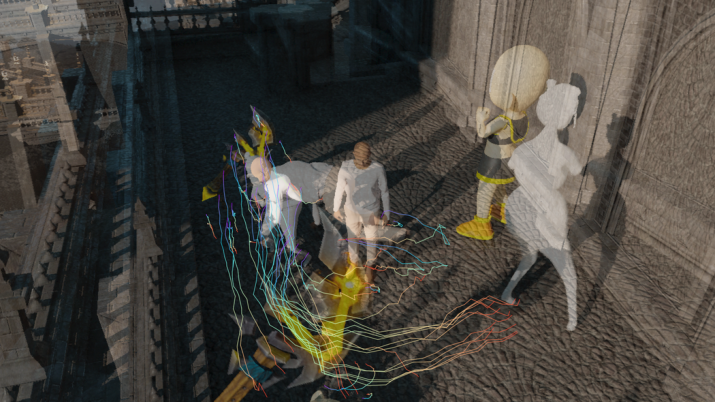 | 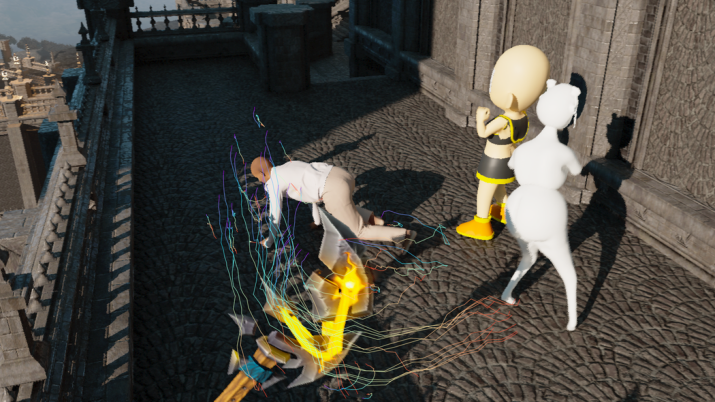 |

</div>

### Final Leaderboard

<div align="center">
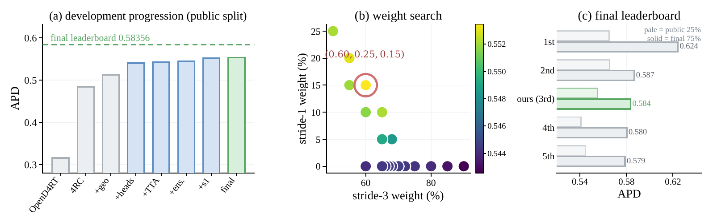
</div>

*(a) Public-split score after each accepted change during development, from the
organisers' OpenD4RT baseline to our submitted system. (b) The ensemble weight
search; the optimum is circled and the surface around it is flat. (c) Final
leaderboard: pale bars the public 25%, solid the final 75%.*

| Rank | Entry | Public | Final | Δ |
|------|-------|--------|-------|---|
| 1 | anonymised | 0.56496 | 0.62426 | +0.0593 |
| 2 | anonymised | 0.56557 | 0.58667 | +0.0211 |
| **3** | **OdaxAI (ours)** | **0.55513** | **0.58356** | **+0.0284** |
| 4 | anonymised | 0.54082 | 0.58024 | +0.0394 |
| 5 | anonymised | 0.54455 | 0.57876 | +0.0342 |
| — | 4RC public submission | 0.48419 | 0.51142 | +0.0272 |
| — | organisers' OpenD4RT baseline | 0.31564 | 0.32217 | +0.0065 |

Our entry **rose one place** between the public and the private split — the
system did not degrade when the evaluation set grew fourfold. The official
leaderboard CSVs are included in
[`reference/private_leaderboard.csv`](reference/private_leaderboard.csv) and
[`reference/public_leaderboard.csv`](reference/public_leaderboard.csv).

---

## Method: Inference-Time Ensemble

### Model Architecture

<div align="center">
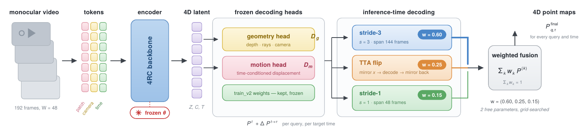
</div>

*The video is patchified into per-frame patch, camera and time tokens and
encoded **once** by the frozen 4RC backbone into the 4D latent. Frozen geometry
and motion heads decode a base point map plus a displacement for any
(query, target time) pair. The same frozen network is evaluated under multiple
inference-time decoding configurations, and their point maps are averaged with
fixed weights. **No parameter is updated at any stage** — the only fitted
quantities in the entire system are the fusion weights.*

### The Decoding Configurations, and How They Combine

<div align="center">
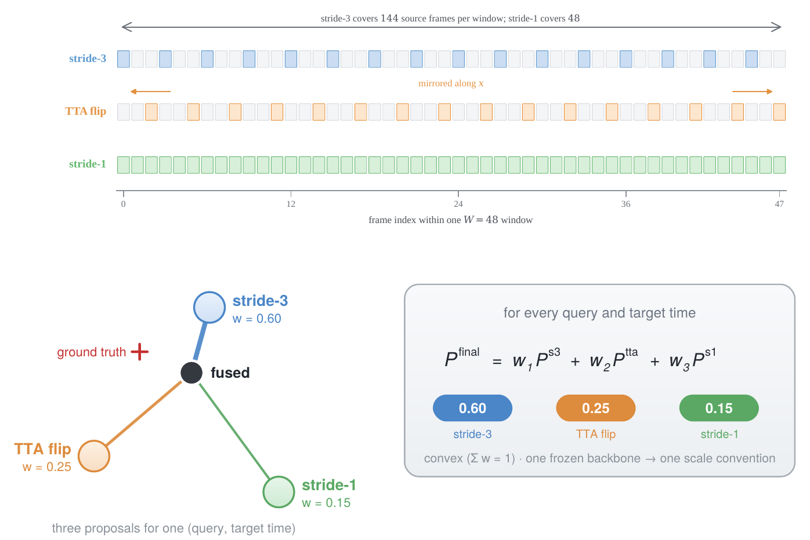
</div>

*Top: which frames each configuration admits inside one W=48 window. Stride-3
admits every third frame and reaches 144 source frames of temporal context;
stride-1 admits all 48 and maximises temporal resolution; the TTA branch runs
the stride-3 pattern on a horizontally mirrored window and mirrors the
predictions back. The three make errors that are only weakly correlated, which
is what the fusion exploits. Bottom: for each query and target time the
configurations propose world-space positions, and the submitted prediction is
their fixed convex combination.*

### The Exact Winning Recipe

The submitted file `opt4_r728_116.csv` is a **plain weighted average of 4
component CSVs** produced by `scripts/plain_merge.py`:

| # | Component | Weight | Configuration | MD5 (uncompressed) |
|---|-----------|--------|---------------|--------------------|
| 1 | `infer_train_v2_submission.csv` | **52.2%** | stride-3, res 512, train_v2 heads | `9ece0f3a…c967de` |
| 2 | `tta_flip_v2_submission.csv` | **21.8%** | stride-3, res 512, horizontal-flip TTA | `332177d9…a72aca` |
| 3 | `4rc_taba_merged.csv` | **14.4%** | stride-3, res 512, TABA v5 refinement | `70a5f144…c549e6` |
| 4 | `res728_component.csv` | **11.6%** | stride-3, res 728 | `d3210701…9d6fd5b` |

All 4 components ship (gzip-compressed) in
[`reference/components/`](reference/components/) with their full hashes in
[`reference/README.md`](reference/README.md). The ensemble recovers
**+0.041 APD** over the frozen baseline — more than any training run achieved —
at zero training cost.

---

## Key Insight: Why Fine-Tuning Fails

The training data covers only **25%** of the evaluation distribution.
Fine-tuning on this narrow slice damages the pre-trained features that the
remaining 75% relies on.

<div align="center">

**Everything we could train on** — the five scenes of `syn4d_sim`

| cave | downtown | japanese | temple | winter |
|:----:|:--------:|:--------:|:------:|:------:|
| 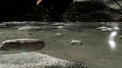 |  |  | 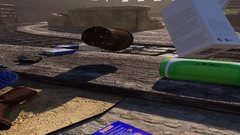 | 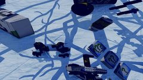 |

</div>

| Attribute | Training (`syn4d_sim`) | Evaluation (challenge) |
|-----------|---------------------|------------------------|
| Frames / clip | 50 | 192 |
| Resolution | 1024×1024 | 1280×720 |
| Aspect ratio | 1:1 | 16:9 |
| Cameras / clip | 8 (multi-view) | 1 (monocular) |
| Rendering variants | 1 (`sim`) | 4, uniform |
| **Test coverage** | **25%** has a training analogue | **75%** zero direct supervision |

**Result**: 12 of 13 fine-tuning configurations degraded the challenge score
while *improving* local validation — the full study is in
[Training Experiments](#training-experiments-negative-results).

---

## Installation

> **Shortcut**: if you only want to verify the winning submission, skip
> installation entirely and use [Docker](#docker) or `bash verify.sh`.

### Step 1 — Clone and install this repository

```bash
git clone https://github.com/odaxai/Gallileo-4D.git
cd Gallileo-4D
pip install -r requirements.txt
```

Requirements: Python 3.10+, PyTorch 2.0+, CUDA 11.8+ (GPU inference only).

### Step 2 — Install the 4RC backbone (GPU inference only)

```bash
git clone https://github.com/Luo-Yihang/4RC.git external/4RC
cd external/4RC && pip install -e . && cd ../..
```

### Step 3 — Download the checkpoint (GPU inference only)

```bash
python -c "from arc.models.arc.arc import Arc; Arc.from_pretrained('Luo-Yihang/4RC_geofinetune')"
```

| Dependency | Source | License |
|------------|--------|---------|
| 4RC backbone | [huggingface.co/Luo-Yihang/4RC](https://huggingface.co/Luo-Yihang/4RC) | Apache 2.0 |
| Gallileo-4D weights | [huggingface.co/OdaxAI/gallileo-4d-weights](https://huggingface.co/OdaxAI/gallileo-4d-weights) | MIT |

### Step 3b — Download Gallileo-4D weights (full reproduction only)

```bash
pip install huggingface_hub
python -c "from huggingface_hub import snapshot_download; snapshot_download('OdaxAI/gallileo-4d-weights', local_dir='weights')"
```

Weights are hosted at [huggingface.co/OdaxAI/gallileo-4d-weights](https://huggingface.co/OdaxAI/gallileo-4d-weights).

> **Note**: These weights are only needed to regenerate the ensemble components
> from raw videos (Level D). For verification of the winning submission, the
> pre-computed components are already included in `reference/components/`.

### Step 4 — Run the test suite

```bash
pip install pytest
python -m pytest tests/ -v
# Expected: 78 passed, 1 skipped
```

---

## Docker

One command, no GPU needed — the container reproduces the winning submission
**bit-for-bit** and verifies it cryptographically (MD5 + SHA256):

```bash
docker pull odaxai/gallileo-4d:latest

mkdir -p results
docker run --rm -v $(pwd)/results:/app/results odaxai/gallileo-4d:latest
```

Expected output:

```
=== Cryptographic verification ===
MD5    expected: 24d729dedd16de4f65e2d67301455c48
MD5    actual:   24d729dedd16de4f65e2d67301455c48
SHA256 expected: 9bb87a133f7af9d2f814373bc5a7f15b00be188d86619b440432fedd5470006e
SHA256 actual:   9bb87a133f7af9d2f814373bc5a7f15b00be188d86619b440432fedd5470006e

SUCCESS: bit-for-bit reproduction of the winning submission
         opt4_r728_116.csv (0.58356 private / 0.55513 public)
```

The reproduced `results/submission.csv` is the exact file submitted to the
challenge. For GPU inference inside the container see [DOCKER.md](DOCKER.md).

---

## Reproducing the Winning Submission

The full input → output chain is verifiable, at increasing depth:

```
challenge videos ──infer_4rc.py──▶ 4 components    bit-identical on RTX 3090  (Level C)
4 components ──plain_merge.py──▶ winning CSV       bit-identical on ANY CPU   (Levels A/B)
```

### Level A — One-command verification (~2 minutes, no GPU)

```bash
bash verify.sh
```

This performs, in order: (1) hash check of the shipped winning submission,
(2) hash check of all 4 components, (3) **bit-for-bit reproduction** of the
winning CSV from the components via `scripts/plain_merge.py`, (4) the pytest
verification suite. Verdict: `ALL CHECKS PASSED (9/9)`.

<details>
<summary><b>Manual equivalent (click to expand)</b></summary>

```bash
# 1. Decompress the components
cd reference/components && gunzip -k *.csv.gz && cd ../..

# 2. Run the exact merge (verifies MD5 automatically)
bash scripts/reproduce_winning.sh reference/components submission.csv
# → SUCCESS: exact reproduction of the winning submission.

# Or fully manually:
python scripts/plain_merge.py \
    --csvs reference/components/infer_train_v2_submission.csv \
           reference/components/tta_flip_v2_submission.csv \
           reference/components/4rc_taba_merged.csv \
           reference/components/res728_component.csv \
    --weights 0.522 0.218 0.144 0.116 \
    --output submission.csv
md5sum submission.csv   # 24d729dedd16de4f65e2d67301455c48
```

`plain_merge.py` emulates fused multiply-add accumulation with portable
IEEE-754 error-free transformations, so the output is **bit-identical on any
CPU architecture** (verified on macOS arm64 and Linux x86_64).

</details>

### Level B — Same, in Docker

See [Docker](#docker) above — identical checks in a fully isolated environment.

### Level C — GPU end-to-end: input videos → CSV (~1 minute)

**Verified**: on the GPU class used for the winning run (NVIDIA RTX 3090), the
inference code regenerates the shipped components **bit-identical** directly
from the raw challenge videos. We verified this by downloading this public
repository fresh onto the inference machine:

| Sequence | Rows regenerated | Bit-identical | Max diff |
|----------|-----------------|---------------|----------|
| `og-antiquity-seq_000000_0` | 16,384 | **16,384 / 16,384** | 0.0 |
| `mixed_no_bedlam-antiquity-seq_000004` | 16,384 | **16,384 / 16,384** | 0.0 |

Run it yourself (requires GPU ≥ 24 GB, 4RC installed, challenge data):

```bash
bash scripts/verify_gpu_inference.sh \
    /path/to/4RC_geofinetune /path/to/challenge_eval /path/to/queries.csv 2
```

On a different GPU model, tiny floating-point differences (< 1e-6) may appear;
the APD score is unaffected.

### Level D — Full regeneration from scratch (~168 GPU-hours)

Regenerate all 4 components with `scripts/infer_4rc.py`, then merge:

<details>
<summary><b>All four component commands (click to expand)</b></summary>

The challenge data must be organised as:

```
/path/to/challenge_eval/
├── og/          ├── antiquity/  ├── dream/  ├── gothic/  └── office/
├── sim/
├── mixed/
└── mixed_no_bedlam/
```

```bash
# Component 1 — base inference, stride=3, res=512 (52.2%)
python scripts/infer_4rc.py \
    --checkpoint /path/to/4RC_geofinetune \
    --benchmark_root /path/to/challenge_eval \
    --queries_csv data/queries.csv \
    --out infer_train_v2_submission.csv \
    --resolution 512 --frame_stride 3

# Component 2 — TTA horizontal flip (21.8%)
python scripts/infer_4rc.py \
    --checkpoint /path/to/4RC_geofinetune \
    --benchmark_root /path/to/challenge_eval \
    --queries_csv data/queries.csv \
    --out tta_flip_v2_submission.csv \
    --resolution 512 --frame_stride 3 --tta_flip

# Component 3 — TABA v5 refinement (14.4%)
python scripts/infer_4rc.py \
    --checkpoint /path/to/4RC_geofinetune \
    --benchmark_root /path/to/challenge_eval \
    --queries_csv data/queries.csv \
    --out 4rc_taba_merged.csv \
    --resolution 512 --frame_stride 3 \
    --cotracker_ckpt /path/to/cotracker3_offline.pth

# Component 4 — higher resolution 728 (11.6%)
python scripts/infer_4rc.py \
    --checkpoint /path/to/4RC_geofinetune \
    --benchmark_root /path/to/challenge_eval \
    --queries_csv data/queries.csv \
    --out res728_component.csv \
    --resolution 728 --frame_stride 3

# Final merge — the exact winning command
python scripts/plain_merge.py \
    --csvs infer_train_v2_submission.csv tta_flip_v2_submission.csv \
           4rc_taba_merged.csv res728_component.csv \
    --weights 0.522 0.218 0.144 0.116 \
    --output submission.csv
```

</details>

Or run the whole pipeline with one script: `bash scripts/node5_run_inference.sh`.
The complete verification protocol, with every expected hash, is in
[VERIFICATION.md](VERIFICATION.md).

---

## Testing

```bash
pip install pytest
python -m pytest tests/ -v
# Expected: 78 passed, 1 skipped
```

| Test file | Tests | What it proves |
|-----------|-------|----------------|
| `tests/test_winning_submission.py` | 11 | The shipped submission is the real one: MD5, SHA256, row count, format, gzip integrity |
| `tests/test_reproduction.py` | 33 | The recipe is exact: component hashes, weights, script integrity, **end-to-end bit-for-bit merge reproduction** |
| `tests/test_gallileo4d.py` | 21 | The pipeline logic is correct: ensemble math, config defaults, submission format, CLI |
| `tests/test_training.py` | 14 | The negative results are documented faithfully: all 13 configs, loss and LoRA implementations |

Continuous integration ([`.github/workflows/tests.yml`](.github/workflows/tests.yml))
runs the entire suite plus the bit-for-bit reproduction on every push, on
Python 3.10 and 3.11.

---

## Software Architecture

The `gallileo4d/` package follows a **hexagonal (ports & adapters)
architecture**: the domain logic is pure Python with no I/O or framework
dependency, every external concern sits behind an explicit interface, and the
application layer is wired by dependency injection. An examiner can read the
domain layer top-to-bottom without touching torch or the filesystem.

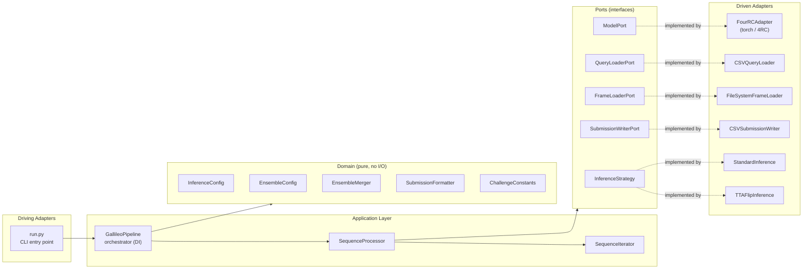

| Layer | Components | Depends on |
|-------|------------|-----------|
| **Domain** | `InferenceConfig`, `EnsembleConfig`, `ChallengeConstants`, `EnsembleMerger`, `SubmissionFormatter` | nothing (pure Python + numpy) |
| **Ports** | `ModelPort`, `QueryLoaderPort`, `FrameLoaderPort`, `SubmissionWriterPort`, `InferenceStrategy` | domain types only |
| **Adapters** | `FourRCAdapter`, `CSVQueryLoader`, `FileSystemFrameLoader`, `CSVSubmissionWriter`, `StandardInference`, `TTAFlipInference` | ports + external tech (torch, filesystem) |
| **Application** | `GallileoPipeline`, `SequenceProcessor`, `SequenceIterator` | domain + ports (never concrete adapters) |

Because the pipeline receives its dependencies through constructor injection,
the entire orchestration is unit-tested with in-memory fakes — no GPU, no
files, no network (`tests/test_gallileo4d.py`).

---

## Training Experiments (Negative Results)

**No training was performed in the final submission.** We tested 13
fine-tuning configurations first; **12 of 13 degraded the challenge score
while improving local validation.** We document this negative result in full
because it is the reason the frozen ensemble exists.

<div align="center">
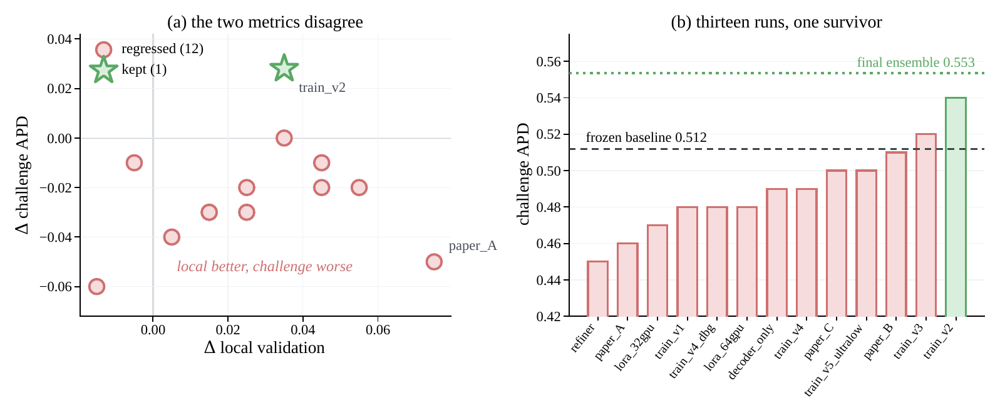
</div>

*(a) Change in local validation against change in challenge APD: eleven runs
land above the horizontal axis locally and below it on the challenge metric.
Only `train_v2` reaches the positive quadrant. (b) Absolute challenge score
per run; the dashed line is the frozen baseline the runs were supposed to
beat, and the dotted line is the final ensemble — which uses no training at all.*

<details>
<summary><b>All 13 training runs (Table 3 of the paper — click to expand)</b></summary>

| Run | Adapted part | LR | Epochs | Local | Challenge | Δ vs frozen |
|-----|--------------|-----|--------|-------|-----------|-------------|
| **Naïve fine-tuning** |
| train_v1 | full network | 5×10⁻⁵ | 1 | 0.42 | 0.48 | −0.032 |
| **train_v2** | full network | 5×10⁻⁶ | 1 | 0.44 | **0.54** | **+0.028** ✓ |
| train_v3 | full network | 5×10⁻⁶ | 3 | 0.46 | 0.52 | +0.008 |
| train_v4 | full, scale-dec. | 1×10⁻⁵ | 1 | 0.45 | 0.49 | −0.022 |
| train_v4d | full, scale-dec. | 1×10⁻⁵ | 1 | 0.43 | 0.48 | −0.032 |
| train_v5 | full network | 1×10⁻⁷ | 1 | 0.40 | 0.50 | −0.012 |
| **Aggressive schedules** |
| paper_A | full network | 1×10⁻⁴ | 5 | **0.48** | 0.46 | −0.052 ⚠️ |
| paper_B | full network | 1×10⁻⁶ | 2 | 0.44 | 0.51 | −0.002 |
| paper_C | full, cosine | 5×10⁻⁶ | 2 | 0.45 | 0.50 | −0.012 |
| **Parameter-efficient** |
| lora_32 | LoRA, rank 16 | 1×10⁻⁴ | 1 | 0.41 | 0.47 | −0.042 |
| lora_64 | LoRA, rank 32 | 5×10⁻⁵ | 1 | 0.42 | 0.48 | −0.032 |
| **Lightweight refinement** |
| refiner | added MLP head | 1×10⁻³ | 1 | 0.39 | 0.45 | −0.062 ❌ |
| decoder | decoder only | 5×10⁻⁵ | 1 | 0.43 | 0.49 | −0.022 |
| **Frozen ensemble** |
| none | frozen + ensemble | — | — | — | **0.553** | **+0.041** ✓✓ |

⚠️ `paper_A` took the **best local score of the study** and the second-worst
challenge score — the inversion in one row. If we had selected on local
validation, this is the checkpoint we would have shipped.

</details>

### Scale Collapse at High Resolution

<div align="center">
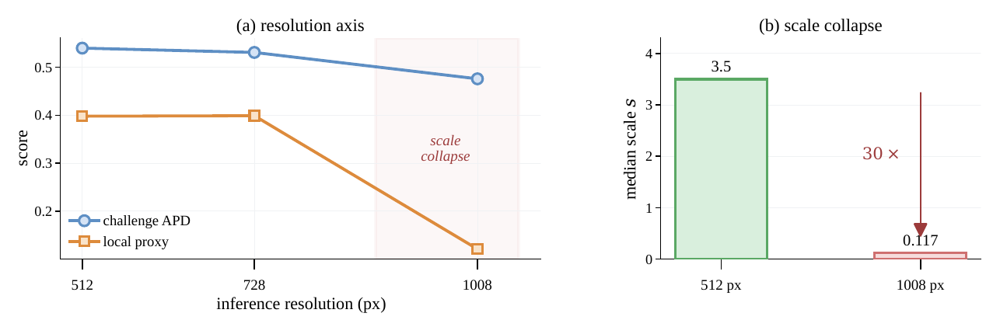
</div>

*Raising the inference resolution to 1008 px drives the predicted median scene
scale from 3.5 to 0.117 — 30× below expected — a collapse that the metric's
median alignment cannot repair. We excluded the axis entirely.*

The training code documenting all 13 configurations is in
[`training/train.py`](training/train.py), with full experiment notes in
[TRAINING_EXPERIMENTS.md](TRAINING_EXPERIMENTS.md) and the rationale in
[NO_TRAINING.md](NO_TRAINING.md).

---

## Qualitative Results

### Reconstruction Detail

<div align="center">

| Office — *trajectories stay smooth and separated as actors cross* | Gothic — *bundles stay coherent through occlusion* |
|:--:|:--:|
| 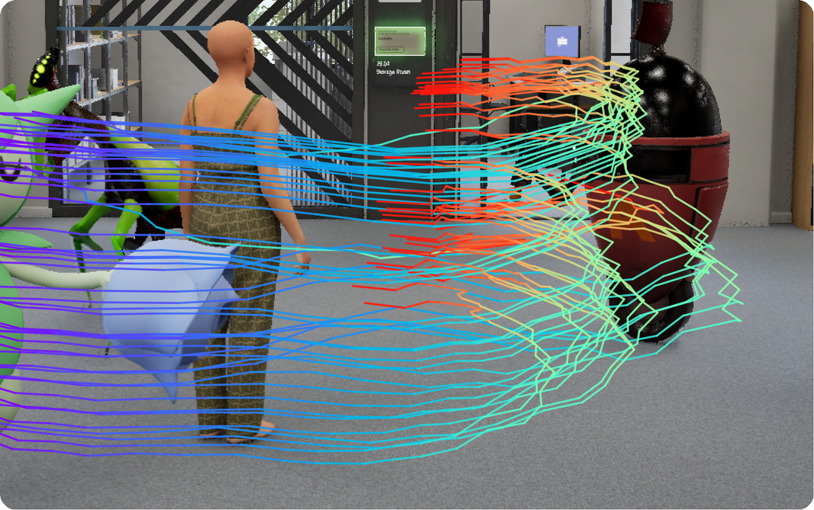 | 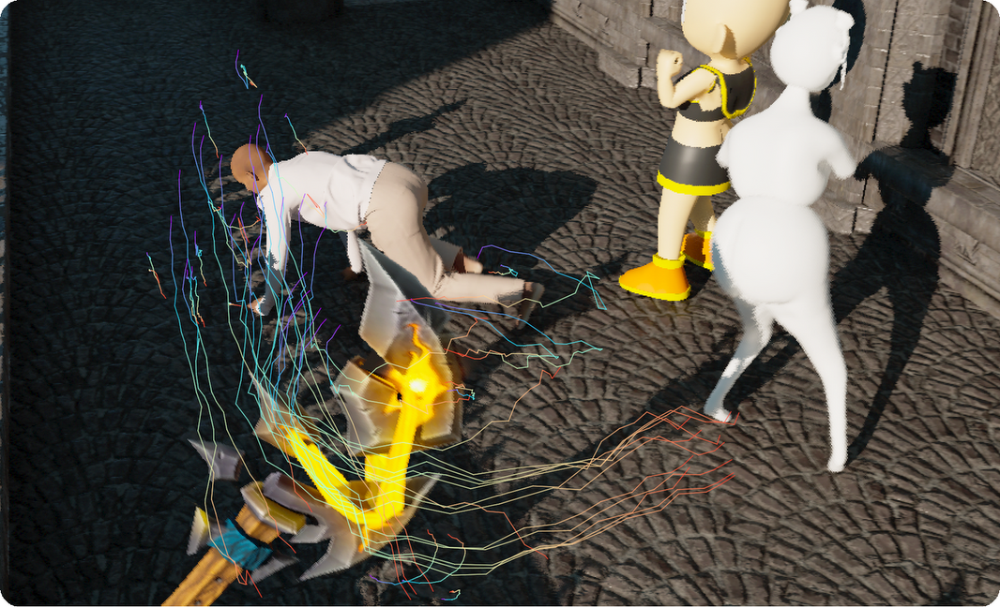 |

</div>

### Zero-Shot Transfer to Real Video

<div align="center">
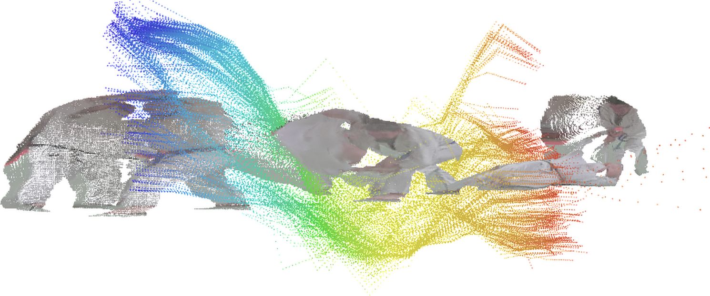
</div>

*The frozen pipeline applied **unchanged** to the judo sequence of DAVIS:
reconstructed geometry with the dense 3D motion field of the throw, coloured
by time. Neither the decoding heads nor the fusion weights were touched, and
the system was never trained or tuned on real footage.*

---

## Repository Layout

```
Gallileo-4D/
├── verify.sh                    # ← ONE-COMMAND VERIFICATION for examiners
├── VERIFICATION.md              # Full verification protocol with every hash
├── DOCKER.md · REPRODUCE.md · ENVIRONMENT.md · NO_TRAINING.md
│
├── scripts/                     # EXACT scripts used for the winning submission
│   ├── infer_4rc.py             #   4RC inference: sliding window, TTA, TABA
│   ├── plain_merge.py           #   the EXACT winning merge (bit-for-bit portable)
│   ├── reproduce_winning.sh     #   merge + automatic MD5/SHA256 check
│   ├── verify_gpu_inference.sh  #   GPU end-to-end check: videos → CSV
│   ├── ensemble_merge.py        #   scale-aligned variant (earlier experiments)
│   └── node5_run_inference.sh   #   full pipeline, all 4 components
│
├── gallileo4d/                  # Python package — hexagonal architecture
│   ├── pipeline.py              #   domain, ports, adapters, application
│   ├── merge.py                 #   merge utility
│   └── run.py                   #   CLI entry point
│
├── training/                    # The 13 documented negative results
│   └── train.py
│
├── tests/                       # 79 tests (78 passed, 1 skipped)
│   ├── test_winning_submission.py
│   ├── test_reproduction.py
│   ├── test_gallileo4d.py
│   └── test_training.py
│
├── reference/                   # Cryptographic ground truth
│   ├── winning_submission.csv.gz      # the submitted file itself
│   ├── components/                    # the 4 ensemble components
│   ├── private_leaderboard.csv        # official final standings
│   └── public_leaderboard.csv
│
├── assets/                      # All figures from the paper
├── Dockerfile · .github/workflows/tests.yml
└── requirements.txt · LICENSE
```

---

## Computational Requirements

| Resource | Specification |
|----------|---------------|
| GPU | NVIDIA RTX 3090 24GB (used for winning run) or better |
| GPU memory | 24 GB minimum |
| CPU RAM | 64 GB recommended |
| Storage | 500 GB for data + checkpoints |
| Runtime | ~168 GPU-hours for all 4 components; ~1 min for the merge |

<details>
<summary><b>SLURM example (click to expand)</b></summary>

```bash
#!/bin/bash
#SBATCH --job-name=gallileo4d
#SBATCH --nodes=1
#SBATCH --gpus-per-node=1
#SBATCH --cpus-per-task=8
#SBATCH --mem=64G
#SBATCH --time=72:00:00

python scripts/infer_4rc.py \
    --checkpoint $CKPT_DIR/4RC_geofinetune \
    --benchmark_root $DATA_DIR/challenge_eval \
    --queries_csv $DATA_DIR/queries.csv \
    --out component.csv \
    --resolution 512 --frame_stride 3
```

</details>

---

## Citation

```bibtex
@inproceedings{gallileo4d2026,
  title={Gallileo-4D: Frozen Backbone Ensemble for Dynamic 4D Reconstruction},
  author={Savioli, Nicol{\`o}},
  booktitle={ECCV 2026 PhysAI Workshop},
  year={2026}
}
```

---

## Acknowledgements

We thank the PhysAI organisers for the Syn4D benchmark and the 4RC authors for
their checkpoints.

## License

MIT License — see [LICENSE](LICENSE). Third-party: 4RC (Apache 2.0, Facebook
Research), DINOv2 (Apache 2.0, Meta AI).

<div align="center">
<br>


**OdaxAI Research** — [odaxai.com](https://odaxai.com)
</div>
